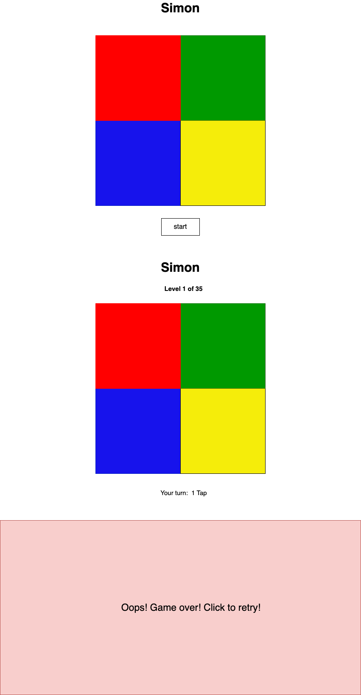

# Planning for Simon

## Analyze the app's functionality

MVP

As a uer....

- I want to be able to have 1 player
- I want to have 4 tiles to play with
- I want to be able to go to next level if I follow the taps correctly
- I want to know on what level I am
- I want to get notified when I win the last level


Plans to improve this game in the future:
- Add scores
- Add more graphic

- clean/minimalists


## Wireframes the UI◊

- High Fidelity
    - Buttons are clickable
    - hover effect happens on buttons
    
- Low Fidelity
    - The app has one page
    - The name of the game (Simon) shows up on top of the page
    - Messages to the user about the level of the game show up on top of the board
    - Messages to the user about the win or failure show up on the bottom of the board
    - Play again button goes on the bottom of the page
    - Drawing and visual layout of the page 

    
    

## Pseudocode

1) Define required constants
    1.1) None
  
2) Define required variables used to track the state of the game
    2.1) sequence
    2.2) playerSequence
    2.3) level

3) Cache DOM elements
    3.1) levelMessage
    3.2) message (win or failure)
    3.3) board (4 tiles)
    3.4) startButton

4) Upon loading the app should:
    4.1) Initialize the state variables
      - set level to 0
      - set (computer)sequence as an empty list
      - set playerSequence as an empty list
      - start button should be visible
      - levelMessage should be hidden
    4.2) Wait for the user to hit the start button
    
5) Handle a player clicking start button
    5.1) Hide the start button
    5.2) Unhide the message showing the level
    5.3) increase level by 1
    5.4) Make the board unclickable
    5.5) Show the message "level x of 35"
    5.6) Create a new sequence
    5.7) Add a delay before playerTurn is run to make sure computer is done with the taps

6) Handle a player clicking a tile
    6.1) Push the clicked tile to the playerSequence
    6.2) Play the corresponding sound for the button that is played
        6.2.1)Grab corresponding tile element from html and use play method on it
    6.3) Compare the length of the playerSequence array to sequence array and show in the message how many taps are left. If 0 taps are left round is over
    6.4) If round is over reset the game
        6.4.1) set the player and computer sequence to empty arrays
        6.4.2) set level to zero
        6.4.3) hide start button and level message
        6.4.4) Make the board unclickable
    6.5) If player sequence number reaches 35 show message of congrats and reset the game


## Identify the application's state (data)

```js
let sequence
```

```js
let playerSequence
```

```js
let level
```
