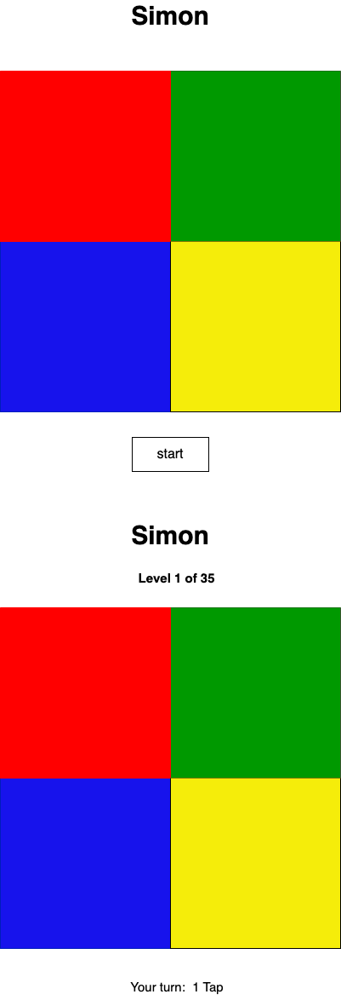

# Planning for Simon Game

## Wireframes the UI◊
<<<<<<< HEAD
    - The name of the game (Simon) shows up on top of the page
    - Messages to the user about the level of the game show up on top of the board
    - Messages to the user about the turns show up on the bottom of the board
    - Play again button goes on the bottom of the page
    - Failure message will take the entire page
    - Drawing and visual layout of the page 
=======

   - The name of the game (Simon) shows up on top of the page
   - Messages to the user about the level of the game show up on top of the board
   - Messages to the user about the turns show up on the bottom of the board
   - Play again button goes on the bottom of the page
   - Failure message will take the entire page
   - Drawing and visual layout of the page 
>>>>>>> 9810711ea80d5c1051c26170129ab343862ccecf

   
    

## Pseudocode

1) Define required constants
    1.1) None
  
2) Define required variables used to track the state of the game
    2.1) sequence
    2.2) playerSequence
    2.3) level

3) Cache DOM elements
    3.1) levelMessage
    3.2) message (win or failure)
    3.3) board (4 tiles)
    3.4) startButton

4) Upon loading the app should:
    4.1) Initialize the state variables
      - set level to 0
      - set (computer)sequence as an empty list
      - set playerSequence as an empty list
      - start button should be visible
      - levelMessage should be hidden
    4.2) Wait for the user to hit the start button
    
5) Handle a player clicking start button
    5.1) Hide the start button
    5.2) Unhide the message showing the level
    5.3) increase level by 1 
    5.4) Make the board unclickable
    5.5) Show the message "level x of 35"
        5.5.1) Create a list of tiles' dataset attributes and pick a random tile from that list
    5.6) Create a new sequence and push the generated random tiles to it
        5.6.1) Loop through the newly created sequence 
        5.6.2) Grab the tile dataset attributes and corresponding sounds
        5.6.3) Change the style of each tile and plays the corresponding sound
    5.7) Add a delay before playerTurn is run to make sure computer is done with the taps
    5.8) Make the board clickable and update the message to say "Your Turn" and give the number of taps the player needs to make by grabing the level value
    5.9) Wait for the user to hit a tile

6) Handle a player clicking a tile
    6.1) Push the clicked tile to the playerSequence
    6.2) Grab corresponding data-sound element for that tile from html and use the play method on it
    6.3) Compare the length of the playerSequence to the computer sequence 
        6.3.1) If they are not equal reset the game
        6.3.2) If they are equal:
            - If the length of both eqals 35 show congrats message and reset the game
            - If not set the player sequence as empty and start the next round afte a second (So that player can see they completed the sequence correctly) by going back to step 5.3

<<<<<<< HEAD
## Technologies I used:
- HTML
- CSS
- JavaScript

## How to play:
Hit start and wait for the computer to show you an order of tiles beeping. Once the computer is done and it says your tun go ahead and try to follow the pattern same as computer by clicking on the tiles. On every round it will add one more tile to the sequences. You can go up to 35 levels. If you hit a wrong tile along the way you will get the game over message. Then you can start over.

=======

## Technologies I used:
- HTML
- CSS
- JavaScript

## How to play:
Hit start and wait for the computer to show you an order of tiles beeping. Once the computer is done and it says your tun go ahead and try to follow the pattern same as computer by clicking on the tiles. On every round it will add one more tile to the sequences. You can go up to 35 levels. If you hit a wrong tile along the way you will get the game over message. Then you can start over.

>>>>>>> 9810711ea80d5c1051c26170129ab343862ccecf
## Next Steps:
- Add graphics
- Add Scores
- Add quit option during the game
<<<<<<< HEAD
=======

>>>>>>> 9810711ea80d5c1051c26170129ab343862ccecf
